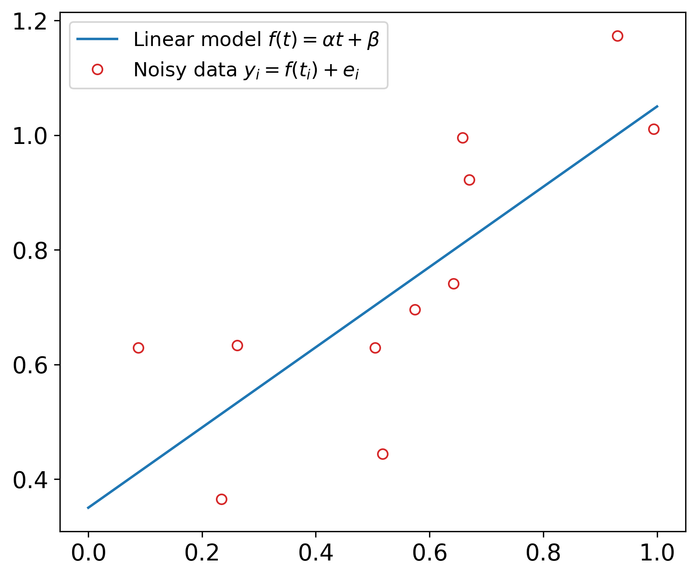
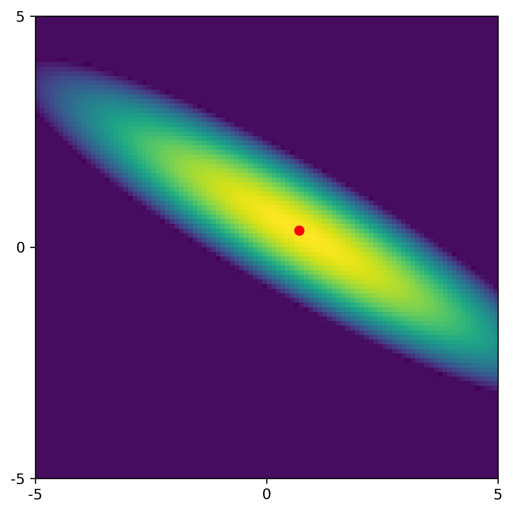
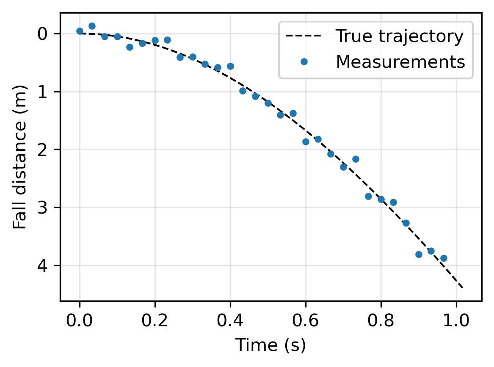

# Errors and Uncertainties and Why They Matter

Measured data inevitably contain errors, and we must understand how such errors influence the results that we compute. In other words, we want to understand the uncertainties in our results caused by the errors in the data. The CUQIpy package provides computational methods that allow us to do that, and this chapters provides the conceptual background for formulating and performing this uncertainty quantification.

**Errors** in measured data are unavoidable. They have many causes, such as imperfections in the measurement device and spurious signals that we cannot avoid recording. In this work we consider the errors to be random (as opposed to deterministic or systematic errors), and we often know - or can estimate - their size and their statistical distribution.

**Uncertainty** is, by definition, "a lack of sureness about something." In our context it refers to the fact that random data errors inevitably lead to an error in the computed solution, and hence this solution has some degree of uncertainty. It is desirable to characterize this uncertainty; for example, we want to know the size and properties of the uncertainty.

**Quantification** refers, in this respect, to the act of rigorously determining the amount and type of uncertainty in the solution, given statistical information about the data errors. This is done using well-defined mathematical/statistical methods and tools. Uncertainty quantification implies that we want more details than just, e.g., a bound for the error in the solution.

There are potentially other types of errors than those coming from the measured data. We use a mathematical model to describe the data, and this model may also be influenced by errors e.g., when we neglect second-order terms in complex models or when some model parameters are slightly incorrect. Moreover, our computations are always influenced, to some degree, by floating-point errors on the computer [B, \S 1.4]. Neither type of errors can be handled by the CUQIpy software, and we will therefore not discuss them here.

It is instructive to illustrate the uncertainty due to data errors with two simple examples of parameter estimation. The first problem in linear, and we have an explicit formula for the solution's covariance matrix which helps illustrate basic aspects of uncertainty quantification. The second problem is nonlinear and thus well suited for illustrating how computational uncertainty quantification can be performed in practice when no analytical expressions are available.

**Example 1: Linear regression.** We are given a linear function
$$f(t) = \alpha\, t + \beta \ ,$$
where the two parameters $\alpha$ and $\beta$ are unknown. We assume that the noisy data $(t_i,y_i)$, $i=1,2,\ldots,m$ are given by
$$    y_i = f(t_i) + e_i = \alpha\, t_i + \beta + e_i \qquad
    \hbox{with} \qquad e_i \sim \mathcal{N}(0,\sigma^2) \ ,$$
and our task is to estimate the two unknown parameters. Since the noise is Gaussian, it is natural to use the method of least squares estimation [B], [HPS]. The least squares estimates $a_{\hbox{\tiny LS}}$ and $b_{\hbox{\tiny LS}}$ are given by
$$
    \alpha_{\hbox{\tiny LS}} = \frac{\sum_{i=1}^m (t_i-\bar{t})(y_i-\bar{y})}%
    {\sum_{i=1}^m (t_i-\bar{t})^2} \ , \qquad
    \beta_{\hbox{\tiny LS}} = \bar{y} - \alpha_{\hbox{\tiny LS}}\, \bar{t} \ ,
$$
where $\bar{t}$ and $\bar{y}$ are the averages of $t_i$ and $y_i$, respectively. The figure below illustrates this for a case with $\alpha=0.7$, $\beta=0.35$, $m=11$ and $\sigma=0.2$, and the least squares estimates are $\alpha_{\hbox{\tiny LS}}=0.88$ and $\beta_{\hbox{\tiny LS}}=0.29$.

<figure>

<figcaption>
</figcaption>
</figure>

A statistical approach gives insight about the influence of the noise on the estimated parameters. This least squares estimation problem is linear, it follows that the two estimates follow a bivariate Gaussian distribution $\mathcal{N} (\mu,\Sigma)$, whose mean $\mu = (\alpha,\beta)$ is the vector of the exact parameters. Moreover, the $2 \times 2$ covariance matrix is given by
$$
    \Sigma = \sigma^2 %\bigl(A^TA\bigr)^{-1} =
    \begin{pmatrix} \sum t_i^2 & \sum t_i \\[2mm] \sum t_i & m \end{pmatrix}^{\!-1} =
    \begin{pmatrix}  0.050 & -0.022 \\ -0.022 &  0.013 \end{pmatrix} .
$$
The 2D Gaussian distribution $\mathcal{N} (\mu,\Sigma)$ is illustrated in the figure below, where the red dot represents the least squares solution for this particular noise realization. Note that $\sigma^2$ appears as a factor in $\Sigma$; as $\sigma \rightarrow 0$ the Gaussian approaches a delta distribution.

<figure>

<figcaption>
</figcaption>
</figure>

This constitutes the quantification of the uncertainties in the least squares estimates. The nonzero off-diagonal elements of $\Sigma$ show that there is quite some correlation between the two estimates, revealing itself by the tilt of the ellipsoid in the figure. The standard deviations for $\alpha_{\hbox{\tiny LS}}=0.88$ and $\beta_{\hbox{\tiny LS}}=0.29$ (the square roots of the diagonal elements of $\Sigma$) are 0.22 and 0.11, respectively. These numbers confirm that both parameters are approximated with some uncertainty.

**Example 2: A falling object.** This example is inspired by a carefully explained case study in [Estimating]. From measurements of an object in a free fall in air (which causes a
drag on the object), we want to determine the gravitational acceleration $g$ and the coefficient of air resistance (or drag) $C$. The dynamics are described by a pair of ordinary differential equations - see [Estimating] for details - and there is an analytical expression for the distance $z$ the object has fallen, as a function of time $t$, from a resting position at time $t=0$:
$$
    z(t) = C^{-1} \log \cosh \left( \sqrt{g\, C} \, t \right) \ .
$$
As expected, this result is independent on the object's mass.

If we measure this distance at times $t_1,\ldots,t_m$ then we obtain noisy data
$$
    y_i = z(t_i) + e_i =C^{-1} \log \cosh \left( \sqrt{g\, C} \, t_i \right) + e_i
    \qquad \hbox{with} \qquad e_i \sim \mathcal{N}(0,\sigma^2) \ .
$$
We assume Gaussian noise with $\sigma = 0.1$, and we use the parameters $g=9.816$ and $C=0.1$.

<figure>

<figcaption>
</figcaption>
</figure>

The two parameters $g$ and $C$ appear nonlinearly in this problem, and hence we use a nonlinear least squares solver to compute the estimates $g_{\hbox{\tiny LS}} = 9.886$ and $C_{\hbox{\tiny LS}} = 0.104$. Assessing the uncertainties in this nonlinear problem cannot be done via a covariance matrix (as in the first example), and in \S\ref{sec:CUQI} we demonstrate how this is done by computational uncertainty quantification and CUQIpy.
