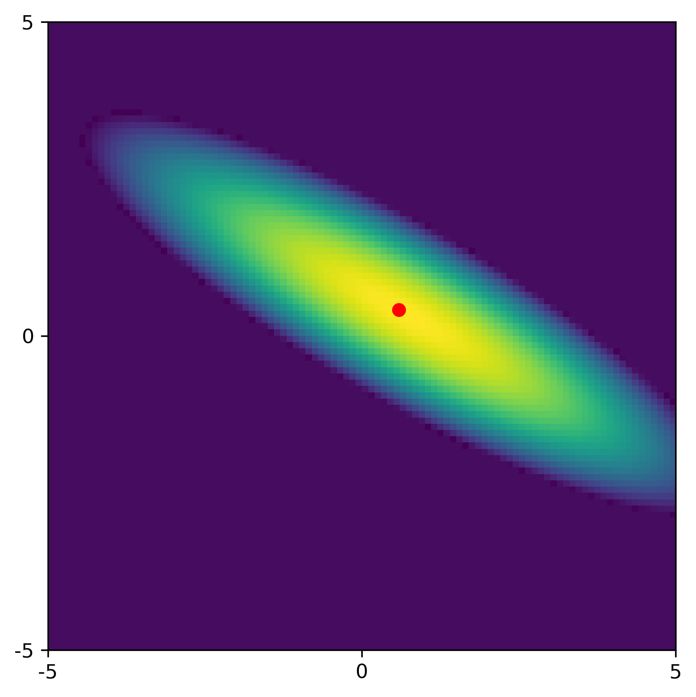

# 1.4 Gaussians priors

For pedagogical reasons it instructive to consider the special case
where both the likelihood and the prior are Gaussian.
Assuming again a linear forward model $b = A\, x$ and noisy data $b_{\mathrm{obs}}$
with iid Gaussian noise, the likelihood function is given by \eqref{eq:GL}.
Moreover, for an iid Gaussian prior we can write
$$
    \pi(x) \propto \exp\left( - \frac{\| x \|_2^2}{2\delta^2} \right) \ .
$$
This prior expresses that we prefer solutions $x$ whose elements
are not "large" according to the parameter $\delta$ that controls
the concentration of the prior around the mean (which is zero here).
The smaller $\delta$ is, the tighter the distribution is around the mean,
meaning the prior favors values of $x$ close to zero;
conversely, the larger $\delta$ is, the more spread out the prior is,
suggesting that $x$ could take a wider range of values with higher probability.

Hence, the posterior is a product of two Gaussian functions and
therefore it is also Gaussian with a closed-form expression
(except for the normalization constant):
$$
    \pi(x|b_{\mathrm{obs}}) \propto
    \exp\Biggl( - \left(  \frac{\| A\, x - b_{\mathrm{obs}} \|_2^2}{2\sigma^2} +
    \frac{\| x \|_2^2}{2\delta^2} \right) \Biggr) \ .
$$
The corresponding covariance matrix for this Gaussian distribution is
$$
    \Sigma = \sigma^2 \bigl( A^TA + \lambda^2 \, I \bigr)^{-1} \qquad
    \hbox{with} \qquad \lambda = \sigma/\delta \ .
$$

We immediately notice a resemblance with Tikhonov regularization mentioned above.
Specifically, the maximum a posterior (MAP) estimate of $x$ - the one what maximizes
the posterior in \eqref{eq:Gpost} - is the one that minimizes the negative
argument of the exponential function.
This optimization problem is identical to the Tikhonov problem in \eqref{eq:Tikhonov}
if we set $\lambda = \sigma/\delta$ (see, e.g., [Bar, \S 4.1]).
Here we immediately recognize an advantage of the Bayesian formulation
because it provides an explicit expression for the parameter $\lambda$.

It is often necessary to extend the simple Gaussian prior in \eqref{eq:Gprior}
to a prior of the form
$$
    \pi(x) \propto \exp\left( - \frac{\| D\, (x-\bar{x}) \|_2^2}{2\delta^2} \right) \ ,
$$
where $\bar{x}$ is the prior mean and $D$ is a suitably chosen matrix
that is used to tailor the prior to our needs.
For example, we can impose smoothness (or regularity) of $x$ by
choosing $D$ as a discretization to a derivative operator; see [Bar \S 4.2] for details.
The use of $D$ is covered in Chapter/Section {\color{magenta}NNN}.

**Example 3: Linear regression with a Gaussian prior.** To illustrate the role of the prior,
we return to the linear regression problem
from Example 1 for which the two least squares estimates
are quite correlated and having large uncertainties.
We choose a Gaussian prior \eqref{eq:Gprior} with $\delta = 0.4$.
Then the MAP estimate and the covariance matrix are
$$
    \alpha_{\hbox{\tiny MAP}} = 0.71 \ , \qquad
    \beta_{\hbox{\tiny MAP}} = 0.36 \ , \qquad
    \Sigma =
    \begin{pmatrix}  0.035 & -0.016 \\ -0.016 &  0.010 \end{pmatrix} .
$$
The figure below shows the posterior with a less elongated ellipse than
the Gaussian for the least squares problem.
The red dot represents the MAP estimate.

<figure>

<figcaption>
</figcaption>
</figure>

Compared to the least squares results without using a prior, 1) we obtain better
estimates, 2) we reduce the correlation between the estimates, and 3) we reduce the
standard deviations of the estimates.

The above example illustrates how casting the estimation problem in the
Bayesian framework gives us more control of the solution than if we use
classical least squares estimation.