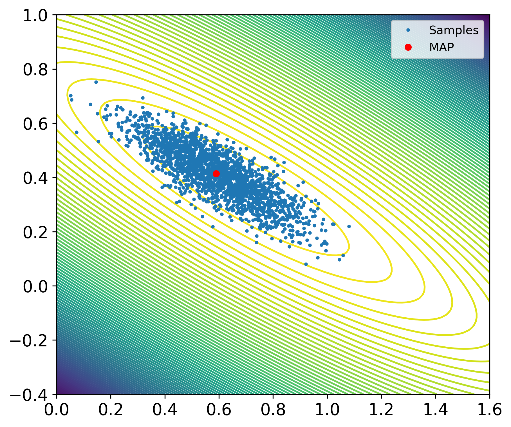
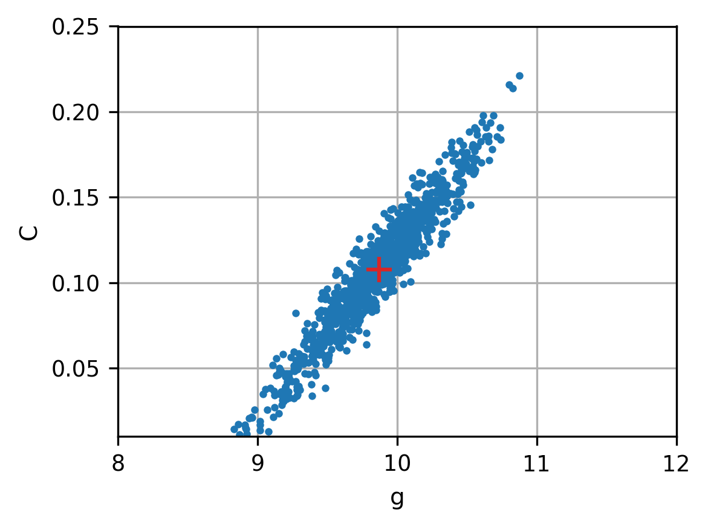
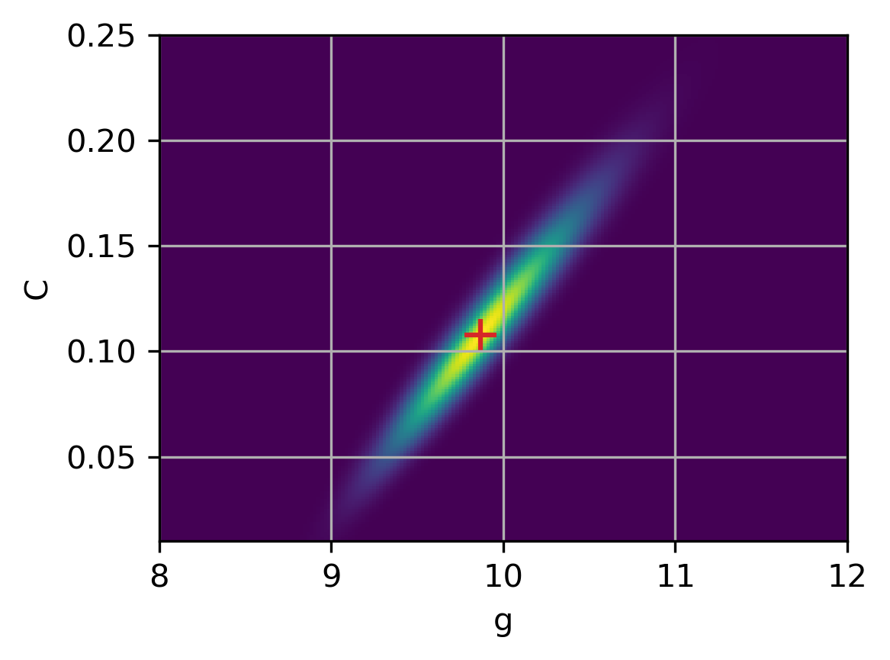
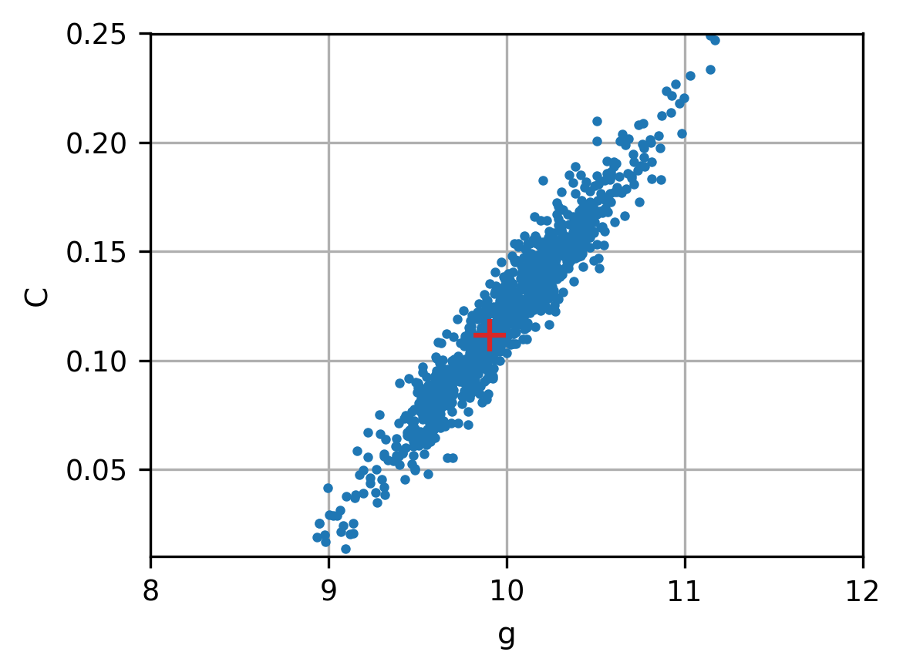
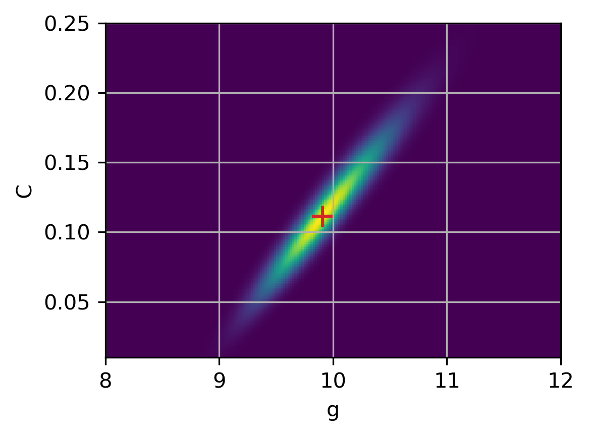
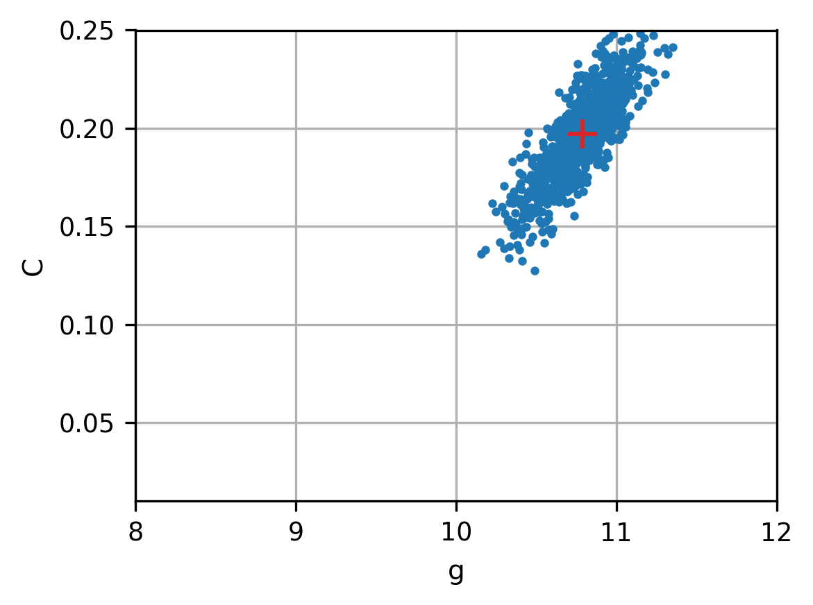
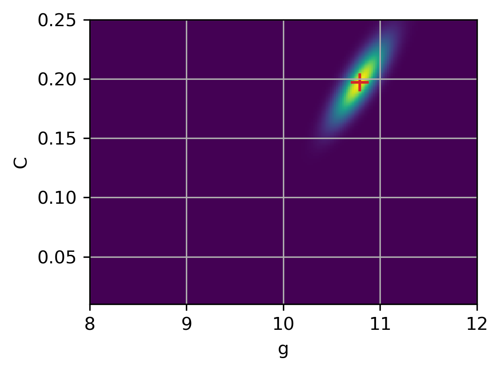

(section:computational-uq)=
# Computational UQ: the need for sampling

In some Bayesian inverse problems, the posterior distribution for $x$
is known in closed analytical form.
However, it may not always be practical to work with: 
for high-dimensional distributions or when the forward model is computationally
expensive, it is a computational challenge to compute posterior moments.
Moreover, in most Bayesian inverse problems the posterior distribution
is not known in analytical form.
Hence, there is a need for a different way to access the posterior.

A distribution function provides a mathematical description
of the behavior of a random variable.
If we produce many outcomes - or samples - of the random variable $x$
following the posterior distribution $\pi(x|b_{\mathrm{obs}})$, then
these samples help us estimate
where most samples are concentrated and how they are spread out,
corresponding to high and low density regions of the probability density function,
respectively.

And even in those cases where we have closed form expression for the posterior,
its use may require large computational efforts,
e.g., to determine posterior moments via numerical quadrature.

This leads to the important concept of **sampling** in uncertainty quantification.
This is a key technique that involves generating many possible outcomes of $x$
following the posterior $\pi(x|b_{\mathrm{obs}})$, thus allowing us
to build a statistical "picture" of its uncertainty via estimates of
variance, covariance, etc.
There are many approaches and methods for sampling, and several of them are
available in CUQIpy and described in later chapters.
For more details, see, e.g., [CS, Chapter 4].
Below, we illustrate the concept of sampling with a few simple examples.

**Example 4: Sampling the Gaussian likelihood in the linear regression problem.** We return to the problem from Example 3 with Gaussian noise and a Gaussian prior,
giving a Gaussian posterior.
It is instructive to present an example of sampling where we can compare
the distribution of samples with the analytic posterior distribution function.
This is shown in the figure below,
where the dots are the samples and the background are contour plots of
the posterior.
Indeed, we see that the density of samples is higher near the
least squares estimate and, overall, follows the Gaussian shape.

<figure>

<figcaption>
</figcaption>
</figure>

**Example 5. Sampling the non-Gaussian posterior in the falling object problem.** We now demonstrate the use of sampling for a Bayesian inverse problem where
there is no simple analytical expression for the posterior.
We use the test problem from Example 2 with the same Gaussian noise and the same
parameters, and with two different priors.
We compute 50,000 samples of the posterior using the
Metropolis-Hasting sampling method - see Chapter XXX
for a discussion of this sampling method.

The first prior was suggested in [Estimating], and we assume that $g$ and $C$
are *uniformly distributed*
in the intervals $[8,12]$ and $[0.01,0.25]$, respectively.
The main role of this prior is to ensure positive estimates, which are
allowed to take values in wide intervals.
The two figures below show the samples and the posterior; the red "plus"
indicates the MAP estimates
$g_{\hbox{\tiny MAP}} = 9.869$ and $C_{\hbox{\tiny MAP}} = 0.108$.
Clearly, the estimates for $g$ and $C$ are correlated as evidenced by
the tilt of the posterior.

<figure>

<figcaption>
</figcaption>
</figure>

<figure>

<figcaption>
</figcaption>
</figure>

The second prior in this example takes the form of a
*truncated Gaussian* distribution for $g$ and $C$ given by
$\mathcal{N}_{\hbox{\tiny trunc}}(\mu,\Sigma,\ell,u)$
with mean, covariance matrix, and lower and upper bounds
$$
    \mu = \begin{pmatrix} 11.0 \\ 0.2 \end{pmatrix} \ , \qquad
    \Sigma = \begin{pmatrix} 4 & 0 \\ 0 & 4 \end{pmatrix} \ , \qquad
    \ell = \begin{pmatrix} 8.0 \\ 0.01 \end{pmatrix} \ , \qquad
    u = \begin{pmatrix} 12.0 \\ 0.25 \end{pmatrix} .
$$
The two values of the mean $\mu$ for this prior are
very different from the values $g=9.816$ and $C=0.1$ used
to synthetically generate the data.
Moreover, the covariance matrix $\Sigma$ is chosen to have large
variance and thus allowing the estimates to take values in a large range.
The samples and the posterior are shown in the figure below, where
the red "plus" indicates the MAP estimates
$g_{\hbox{\tiny MAP}} = 9.906$ and $C_{\hbox{\tiny MAP}} = 0.111$.

<figure>

<figcaption>
</figcaption>
</figure>

<figure>

<figcaption>
</figcaption>
</figure>

These two priors, that allow a wide range of values of the estimates,
give rise to posteriors that are primarily determined by the likelihood.
Therefore, the mean of the prior - whose values are far from the
parameters used in the data simulation - plays only a minor role and
hence both priors give results that are quite similar with good estimates.

We finish with an example that clearly illustrates the role played
by the prior.
If we believe that our chosen mean $\mu$ reflects the true values
of the parameters $g$ and $C$, then we should choose a covariance
matrix $\Sigma$ with small variance.
This gives a "strong prior"
that puts a lot of emphasis on the mean because the posterior is
now dominated by the prior.
This is all good if the mean if well chosen - but it can also be
dangerous if we have too much confidence in a bad prior that does not
reflect reality.

**Example 6. Sampling with a bad prior.** We return to the example with the falling object with a
truncated Gaussian distribution for the prior, and
we use the same mean $\mu$ as in the previous example.
But this time we use a covariance matrix with much smaller variance
$$
    \Sigma = \begin{pmatrix} 0.04 & 0 \\ 0 & 0.04 \end{pmatrix} ,
$$
which expresses a strong belief in the mean.
The samples and the posterior are shown in the figures below.

<figure>

<figcaption>
</figcaption>
</figure>

<figure>

<figcaption>
</figcaption>
</figure>

The MAP estimates are $g_{\hbox{\tiny MAP}} = 10.788$ and $C_{\hbox{\tiny MAP}} = 0.197$.
This posterior is more concentrated due to the strong prior - but
due to the bad choice of the mean the estimates are far from the
actual values.

This concludes the introduction to computational uncertainty quantification
for inverse problems.