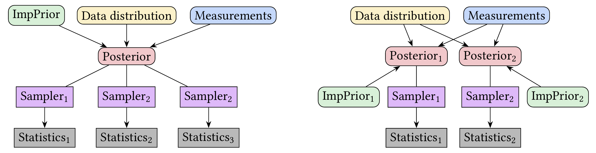

# A Computational Framework and Implementation of Implicit Priors in Bayesian Inverse Problems

## Summary

Bayesian modeling can be done using many families of prior distributions, each with their own behaviours. Most of the time, these priors are defined by explicitely writing down their probability density function (pdf), and we can call these explicit priors. In this work, {cite}`everink2025computational`, we study the opposite, priors for which writing down or computing their pdf is either expensive or impossible.

Although some structure is lost by not having access to a pdf, we can still construct intricate priors that allow for efficient posterior samples. Examples of methods we have in CUQIpy, see [Chapter 10](..//chapter01_m/chapter01_m.md), include:
- Generative models allow for describing a parameter space that can be described using a complicated low-dimensional manifold using a simpler latent space.
- Plug-and-Play (PnP) priors allow for turning deep-learning based denoising methods into prior distributions.
- Regularized Gaussian Distributions allow for turning the deterministic effect of sparsity-promoting regularization and constraints into priors.

Whilst all implicit, these three families of priors are all rooted in different techniques, so implementing them all in a single computational framework such as CUQIpy requires additional care. Therefore, we developed a general framework for studying these implicit priors from a computational perspective, with a focus on their relation to more well-understood explicit priors. 

Improving our understanding of their implicit nature helped us decisions in their implementation. For example, in their relation to samplers as described in the figure below.

<figure>

<figcaption>Diagrams of two interpretations of implicit priors as part of a Bayesian modeling pipeline.

On the left, the implicit prior is considered separate from the sampler. For example, the `cuqi.implicitprior.RestorationPrior` can contain an arbitrary restorator, and can be used with any sampling algorithm that accepts restoratos, such as `cuqi.sampler.ULA`.

On the right, the implicit prior is strongly linked to a specific sampling method. Each implicit prior forces the use of a specific sampler, such that once a posterior is formed, the limiting summary statistics are fixed. For example, the `cuqi.implicitprior.RegularizedGaussian` requires the use of `cuqi.sampler.RegularizedLinearRTO`.
</figcaption>
</figure>

## Resources
- Paper: {cite}`everink2025computational`
- Paper code GitHub repository: https://github.com/CUQI-DTU/Paper-Implicit

