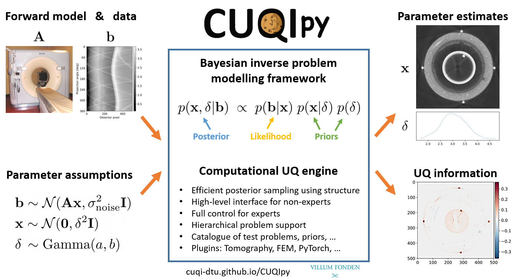

#  1. Overview of CUQIpy


## 1.1. What is CUQIpy?
 **C**omputational **U**ncertainty **Q**uantification for **I**nverse problems in **Py**thon (CUQIpy) is a Python package that  provides a framework for solving inverse problems using Bayesian inference.

CUQIpy framework enables:
* Modeling Bayesian inverse problems
* Solving Bayesian inverse problems using classical as well as recent and advanced computational methods
* Analyzing the solution, i.e., the posterior distribution, of Bayesian inverse problems

The following figure is a schematic overview of the CUQIpy framework, which shows the main components of the framework and how they are connected. The user supplies the forward model (or alternatively uses one of the predefined forward models in CUQIpy), the data, and the statistical assumptions about the various unknown parameters and the data. The user then uses CUQIpy to model and solve the Bayesian inverse problem and to analyze and visualize the solution. 



## 1.2. Why CUQIpy?
CUQIpy is built to address the need for:
  - A unified framework for solving Bayesian inverse problems across various scientific and engineering applications
  - A platform for modeling, solving and analyzing the solution of Bayesian inverse problems
  - A tool that can be used for both research and teaching
  - A tool that can be used by both beginners and advanced users
  - A tool that combines classical and advanced and scalable numerical methods for solving Bayesian inverse problems
  - A tool that is implemented purely in Python with few external package dependencies, which makes it easy to maintain and integrate with other tools


## 1.3. CUQIpy modules
CUQIpy consists of many modules for modeling, solving, and analyzing Bayesian inverse problems.
These modules mostly correspond to typical components and tools needed for modeling and solving Bayesian inverse problems.
Each module contains classes and functions that are designed to perform specific tasks.
For an overview of the modules available in CUQIpy refer to the [CUQIpy API reference](https://cuqi-dtu.github.io/CUQIpy/api/index.html).


## 1.4. CUQIpy plugins

In addition to the CUQIpy modules, CUQIpy also has plugins that extend the functionality of the framework. 
These plugins allow integration of third-party software and tools with CUQIpy.
To see the full list of available CUQIpy plugins, visit the [CUQIpy plugins](https://cuqi-dtu.github.io/CUQIpy/#cuqipy-plugins) section in CUQIpy documentation.


## 1.5. CUQIpy design principles
A number of design principles have guided the development of CUQIpy, including:

* Provide simple and intuitive interface for users
* Design for flexibility, extensibility, modularity, and maintainability
* Accommodate both beginners and advanced users:
  - Provide a set of test problems to use for experimentation and prototyping
  - Automatic sampler selection for a range of problems
  - Enable advanced customization of the problem setup and solution
* Aligning the modeling code with the mathematical formulation of the problem
 
Here we show an example of the alignment of CUQIpy modeling code with the mathematical formulation of a Bayesian inverse problem. Consider the following statistical assumptions about the unknown parameters and the data, which we refer to as a *Bayesian model*:

$$
\begin{align*}
d &\sim \text{Gamma}(1, 10^{-4})\\
s &\sim \text{Gamma}(1, 10^{-4})\\
x &\sim \text{LMRF}(\mathbf{0}, d^{-1})\\
y &\sim \text{Gaussian}(\mathbf{A}\mathbf{x}, s^{-1}\mathbf{I})\\
\end{align*}
$$

where $x$ is the unknown parameter we are interested in characterizing and $y$ is the data. $d^{-1}$ and $s$ are additional unknown parameters, we refer to as hyperparameters. Here, $d^{-1}$ and $s^{-1}$ represent the precision parameters, the inverse of the variance, of the Laplace Markov Random Field (LMRF) prior of $x$ and the Gaussian distribution used to define the data distribution of $y$, respectively. $\mathbf{A}$ is the forward operator. The joint distribution of these random variables is given by

$$
\begin{align*}
p(d,s,x,y) &= p(d)p(s)p(x|d)p(y|x,s)
\end{align*}
$$

The corresponding Bayesian model and joint distribution in CUQIpy takes the following form:
```python
d = Gamma(1, 1e-4)
s = Gamma(1, 1e-4)
x = LMRF(0, lambda d: 1/d)
y = Gaussian(A@x, lambda s: 1/s)
joint = JointDistribution(d, s, x, y)
```


